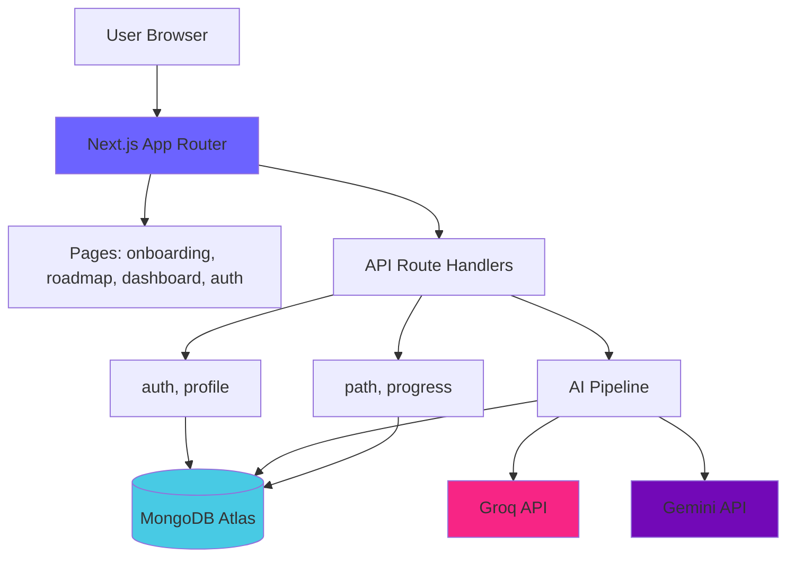
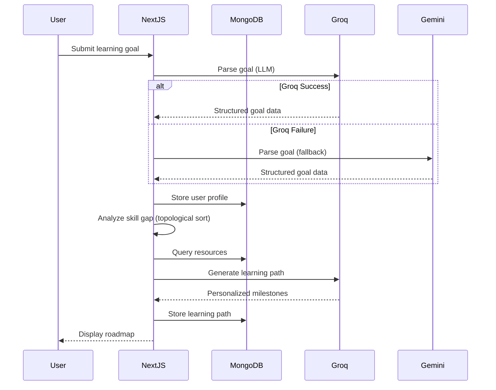
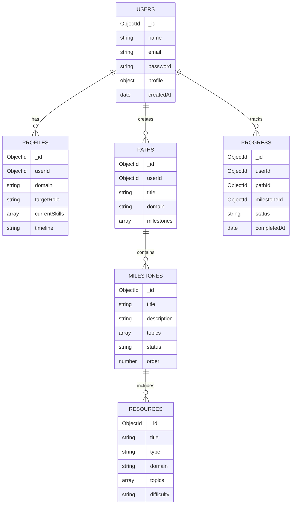

# AI-Powered Personalized Learning Path Recommender

Built for **HCLTech Amplified Hackathon — Round 2**

Describe your learning goal in plain English. Get a personalized, explainable, prerequisite-aware learning roadmap — and watch it adapt as you progress.

- **Repository:** https://github.com/maheshshinde9100/hcltech-amplified-r2-project
- **Live Application:** https://hcltechamplifiedhackathon.vercel.app/

---

## Problem

Online learning platforms provide a large number of courses, but learners often struggle to identify:

* What to learn first
* Which skills they are missing
* Which resources are relevant
* How different skills depend on each other

- **Conversational onboarding** — describe your goal in natural language; the AI extracts your profile and asks clarifying questions.
- **Learner profiling engine** — interests, experience level, completed courses, career goals, learning style.
- **Recommendation engine** — content-based matching of resources to your specific skill gaps.
- **Personalized learning path generator** — ordered milestones with explicit prerequisites, not just a flat course list.
- **Explainable AI assistant** — every recommendation comes with a "why this was suggested" explanation grounded in your actual profile, plus a Q&A chat for your path.
- **Progress dashboard** — completion percentage, skills gained, milestone timeline, next recommended action.
- **Adaptive re-planning** — mark a milestone as "struggling" and the AI regenerates the remaining path around it.

## Key Features

### System Architecture



### Data Flow Architecture



### Database Schema



### Deployment Architecture

```mermaid
graph LR
    GitHub[GitHub Repository] --> Vercel[Vercel Platform]
    Vercel --> Frontend[Frontend + API Routes]
    Vercel --> Functions[Serverless Functions]
    Functions --> MongoDB[(MongoDB Atlas)]
    Functions --> Groq[Groq API]
    Functions --> Gemini[Gemini API]
    
    style Vercel fill:#000000
    style MongoDB fill:#48CAE4
    style Groq fill:#F72585
    style Gemini fill:#7209B7
```



**High level architecture:** A single Next.js application with unified deployment target. Route Handlers run as Vercel serverless functions alongside the frontend, eliminating the cold-start delay typical of free container platforms like Render.

## Tech Stack

* **Frontend:** Next.js, JavaScript, Tailwind CSS
* **Visualization:** Recharts, React Flow
* **Backend:** Next.js API Route Handlers
* **Database:** MongoDB Atlas
* **AI:** Google Gemini + Groq
* **Authentication:** JWT + bcryptjs
* **Deployment:** Vercel
* **CI:** GitHub Actions

## Architecture

```text
Browser
   |
   v
Next.js App
   |
   +---- MongoDB Atlas
   |
   +---- Google Gemini
   |
   +---- Groq
```

## Project Structure

```text
app/            Next.js pages and API routes
components/     Reusable UI components
lib/            Auth, MongoDB, LLM, recommendation and skill-graph logic
scripts/        Resource seeding
docs/           Architecture and solution documentation
```

## Local Setup

```bash
git clone https://github.com/maheshshinde9100/hcltech-amplified-r2-project.git
cd hcltech-amplified-r2-project
npm install
```

Create `.env.local`:

```env
MONGODB_URI=your_mongodb_connection_string
JWT_SECRET=your_jwt_secret
GROQ_API_KEY=your_groq_api_key
GEMINI_API_KEY=your_gemini_api_key
```

Run:

```bash
npm run dev
```

Open `http://localhost:3000`.

## Environment Variables

| Variable         | Description                                          |
|-------------------|--------------------------------------------------------|
| `MONGODB_URI`      | MongoDB Atlas connection string                        |
| `JWT_SECRET`       | Secret used to sign/verify JWTs                        |
| `GROQ_API_KEY`     | Free-tier Groq API key (primary LLM provider)           |
| `GEMINI_API_KEY`   | Free-tier Gemini API key (fallback LLM provider)         |

## AI/ML Approach

- **Goal understanding:** LLM-based structured extraction (strict JSON
  instructions + manual validation, retried once on malformed output)
  from free-text learner input, with clarifying follow-up questions
  for missing fields.
- **Skill gap analysis:** rule-based comparison against a curated
  skill-taxonomy graph (topics + prerequisite edges) per domain, using
  a hand-rolled topological sort — no LLM call needed for this step.
- **Recommendation:** content-based filtering — topic overlap,
  difficulty match, and resource-type diversity scoring, computed
  in-process against the MongoDB `resources` collection.
- **Path generation:** milestones ordered by the topologically-sorted
  skill gap, with one batched LLM call generating friendly
  titles/descriptions for readability.
- **Explanations:** grounded (RAG-lite) prompting — only the learner's
  own profile + the specific milestone are passed to the LLM, so
  explanations reference real facts about the learner.
- **Adaptivity:** milestone status/feedback triggers a re-run of the
  skill-gap + recommend + generate-path logic for remaining
  (incomplete) milestones only, called in-process (not via HTTP) for
  speed on Vercel's serverless functions.

## Team

See [`team.txt`](team.txt) for the full issue-by-issue breakdown and
ownership across the 5 team members.

## Deployment

The application is deployed using 100% free services on a single platform:

| Component        | Platform       | Notes                                    |
|------------------|----------------|------------------------------------------|
| Frontend + API   | Vercel (Hobby) | Auto-deploys on push to `main`; PR previews included |
| Database         | MongoDB Atlas  | Free M0 shared cluster                   |
| LLM API          | Groq / Gemini  | Free-tier API keys                       |

No separate backend hosting is required. Everything ships as one Vercel project, which avoids the cold-start delay that free-tier container platforms (Render, Railway) introduce after inactivity.

## Technical Challenges

- **LLM Output Structuring:** Maintaining reliable JSON output without a typed schema library. Solved with explicit prompt instructions, manual key/type validation, and a one-shot retry mechanism with correction.
- **Milestone Sequencing:** Correctly ordering milestones with cross-topic prerequisites. Solved with a hand-rolled topological sort algorithm over the skill taxonomy graph.
- **MongoDB Connection Management:** Safe connection handling across serverless invocations. Solved with a cached/singleton client pattern in `lib/mongodb.js`.
- **Personalized Explanations:** Making AI explanations feel personal rather than generic. Solved by grounding every explanation prompt in the learner's actual stored profile data.

## License

ISC License
