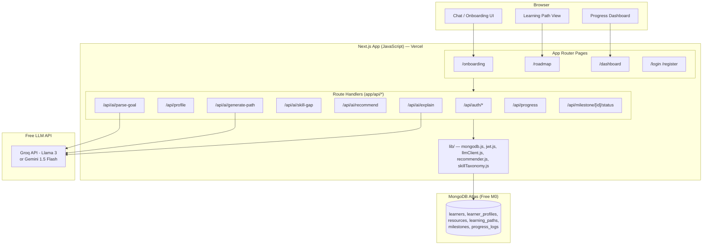
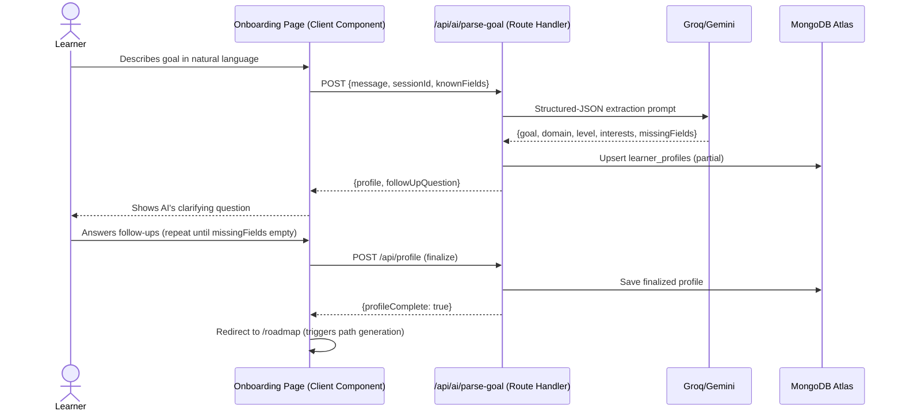
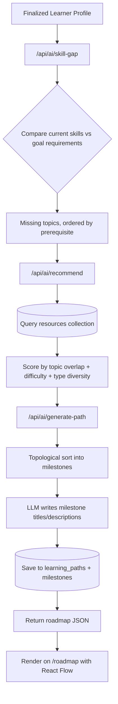
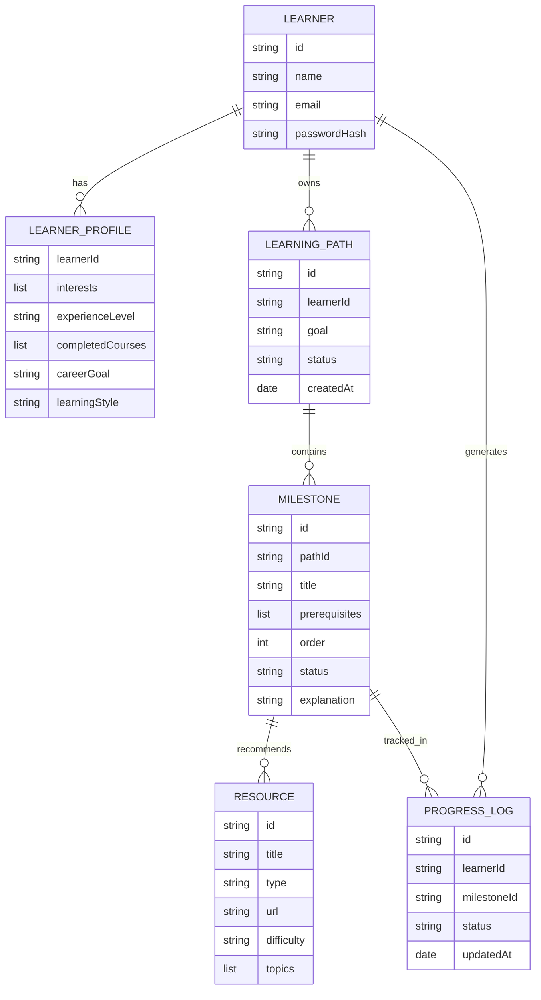
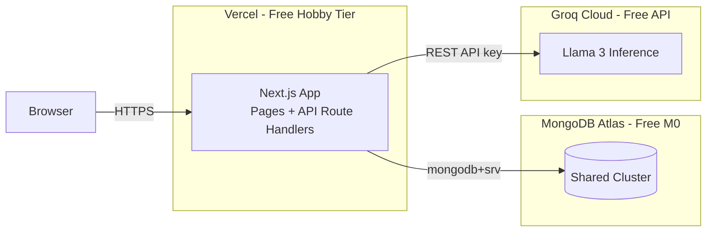

# AI-Powered Personalized Learning Path Recommender — Diagrams (Next.js Edition)

## 1. System Architecture



**Why this is simpler:** everything — frontend, auth, business logic,
and AI orchestration — lives in one Next.js codebase deployed as one
Vercel project. Route Handlers (`app/api/**/route.js`) run as Vercel
serverless/edge functions, calling MongoDB Atlas and the LLM API
directly via `fetch`. No separate backend service to deploy, no
cold-start "server sleeping" issue like a free Render instance.

## 2. Learner Onboarding & Profiling Flow



## 3. Learning Path Generation Flow



## 4. Adaptive Feedback Loop

```mermaid
stateDiagram-v2
    [*] --> PathAssigned
    PathAssigned --> InProgress: Learner starts milestone
    InProgress --> Completed: Marked complete
    InProgress --> Struggling: Low feedback / stuck
    Struggling --> PathAdjusted: PATCH /api/milestone/[id]/status
                                  triggers /api/ai/generate-path
                                  for remaining milestones only
    PathAdjusted --> InProgress: New resource suggested
    Completed --> NextMilestone: /api/progress recalculated
    NextMilestone --> InProgress
    NextMilestone --> GoalAchieved: All milestones done
    GoalAchieved --> [*]
```

## 5. Data Model (ER-style, unchanged)



## 6. Deployment Architecture (Free, single platform)



**Deployment note:** Vercel serverless functions are fast and don't
"sleep" the way a free Render/Railway web service does — this is the
main latency win over the Spring Boot + FastAPI split-service setup.
